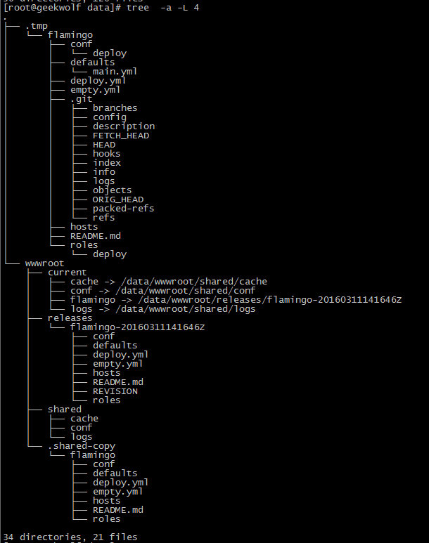

# Flamingo -基于Ansible的自动化代码发布工具

&nbsp;&nbsp;&nbsp;&nbsp;&nbsp;&nbsp;&nbsp;&nbsp;Flamingo("火烈鸟")是基于Ansible的自动化代码发布工具，对Ansisrano进行了改造可以通过传入语言环境,主机组(应用组/灰度机组等),项目代码库,分支名称,项目名称等参数来进行自动化打包发布,也可以将Flamingo工具二次打包使用</br>
&nbsp;&nbsp;&nbsp;&nbsp;&nbsp;&nbsp;&nbsp;&nbsp;Flamingo本着回滚即发布的原则以简化发布流程，回滚时传入要回滚的分支即可，其他参数可参看defaults/main.yml进行了解;(注:依赖Git/rsync/ansible)</br>

**目的:** 通过Ansible实现统一的代码发布方式，思路基于Capistrano</br>
**例子:**</br>
```
ansible-playbook  deploy.yml  --extra-vars='flamingo_git_repo=https://github.com/geekwolf/flamingo.git flamingo_product_name=flamingo'

```
**生成的目录结构(如下图):**</br>

</br>

**代码回滚:** 回滚即发布,通过结合jenkins选择已发布的release重新构建即可，详细参数可通过defaults/main.yml文件了解</br>

**TODO**:</br>
> * 增加前端构建及JAVA打包功能


